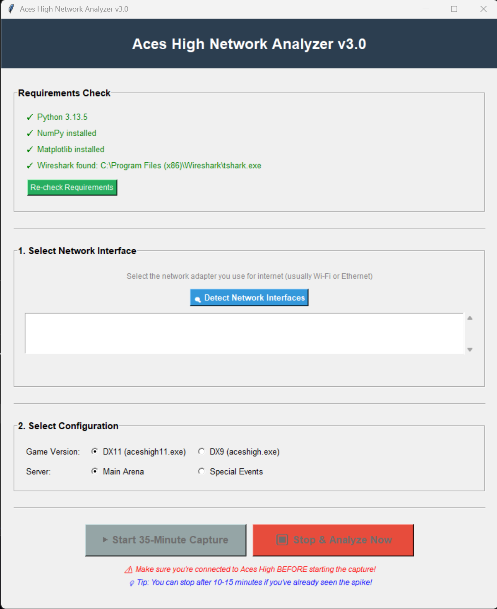
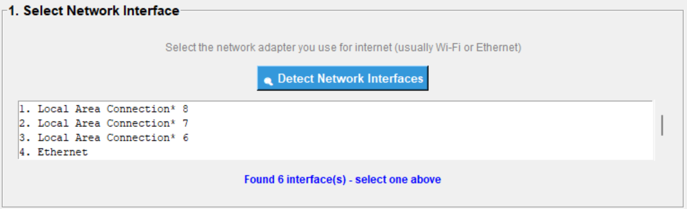
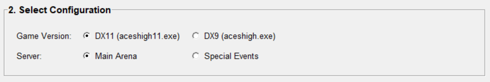
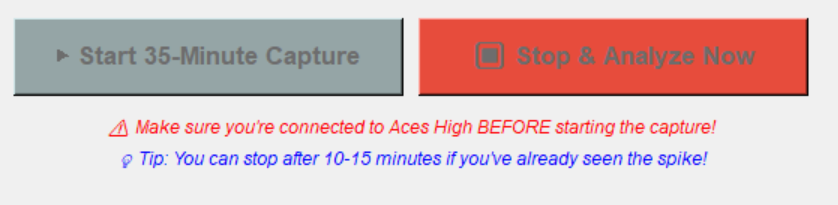
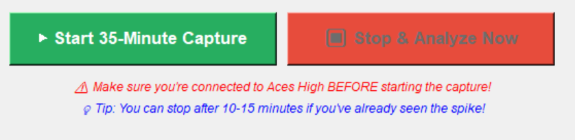

# Aces High Network Analyzer

A network packet capture and analysis tool for investigating the 10-minute freeze issue in Aces High II.

## Purpose

This tool captures UDP network traffic to Aces High game servers and analyzes packet arrival rates over time. It helps verify whether packet rate drops occur at regular 10-minute intervals, particularly when using the DX11 client on the Main Arena server.

## Features

- Automated network interface detection
- 35-minute capture duration (3 complete 10-minute cycles)
- Real-time progress monitoring
- Early stop option after observing the first occurrence
- Automatic analysis with graph generation
- Identifies packet rate dips at 10, 20, and 30-minute marks

## Requirements

- Windows (tested on Windows 10/11)
- Python 3.8 or newer
- Wireshark (includes tshark and Npcap)
- Python packages: numpy, matplotlib

## Installation

1. **Install Python**
   - Download from [python.org](https://www.python.org/downloads/)
   - Check "Add Python to PATH" during installation
   - Use default installation location

2. **Install Wireshark**
   - Download from [wireshark.org](https://www.wireshark.org/download.html)
   - Install Npcap when prompted
   - Use default installation location

3. **Download the analyzer**
   
   [See the releases link on the right](https://github.com/steelington/Aces-High-Network-Analyser/releases/download/v1.0.0/)
   ```


## Usage

1. **Run as Administrator** (required for packet capture)
   - Double-click `START_ANALYZER.vbs`
   - Or right-click `aces_analyzer_v3.py` → "Run as Administrator"

2. **Check requirements**
   - The tool will verify all dependencies are installed
   - Green checkmarks indicate ready to proceed



3. **Select network interface**
   - Click "Detect Network Interfaces"
   - Choose your active internet connection (Wi-Fi or Ethernet)
   - Avoid Loopback, Bluetooth, or Virtual adapters



4. **Configure capture settings**
   - Select game executable: DX11 or DX9
   - Select server: Main Arena or Special Events



5. **Start capture**
   - Launch Aces High and connect to the server **before** starting capture
   - Click "Start 35-Minute Capture"
   - Continue playing normally



6. **Stop early (optional)**
   - If the 10-minute freeze occurs, you can click "Stop & Analyze Now"
   - 10-15 minutes is sufficient to observe the pattern



7. **View results**
   - Check the `results` folder for:
     - PNG graph showing packet rate over time
     - TXT report with analysis summary

## Expected Results

### DX11 on Main Arena
- Packet rate drops at 10, 20, and 30 minutes
- Graph shows clear dips at these intervals

### DX9 or Special Events
- Smooth packet rate throughout capture
- No significant drops at 10-minute intervals

## Output Files

All results are saved in the `results` folder:

- `*.png` - Graph of packet arrival rate over time
- `*.txt` - Analysis report with statistics
- `*.pcapng` - Raw packet capture (for advanced analysis)
- `*_metadata.json` - Capture metadata

**Note:** Do not share `.pcapng` files publicly as they contain your IP address.

## Troubleshooting

### "No packets captured"
- Verify you selected the correct network interface
- Ensure you were connected to Aces High during capture
- Try a different network interface from the list

### "Wireshark/tshark not found"
- Reinstall Wireshark to the default location
- Verify Npcap was installed
- Restart your computer after installation

### "Python package missing"
- Run: `pip install numpy matplotlib`
- Or let the tool auto-install when prompted

### Permission errors
- Always run as Administrator
- Use `START_ANALYZER.vbs` for automatic elevation

## Technical Details

- **Capture method:** tshark with UDP filter for game server IPs
- **Analysis:** 50-packet sliding window for rate calculation
- **Graph resolution:** 150 DPI PNG output
- **Server IPs:**
  - Main Arena: 47.190.119.207
  - Special Events: 47.190.119.206

## Files

- `aces_analyzer_v3.py` - Main application
- `START_ANALYZER.vbs` - Launcher with automatic admin elevation
- `README.html` - Detailed user guide with embedded screenshots
- `README.txt` - Plain text guide

## Contributing

Bug reports and improvement suggestions are welcome. Please include:
- Operating system version
- Error messages or screenshots
- Steps to reproduce the issue

## License

This tool is provided as-is for community investigation purposes.

## Credits

Created for the Aces High community to independently verify and investigate network behavior during gameplay.
